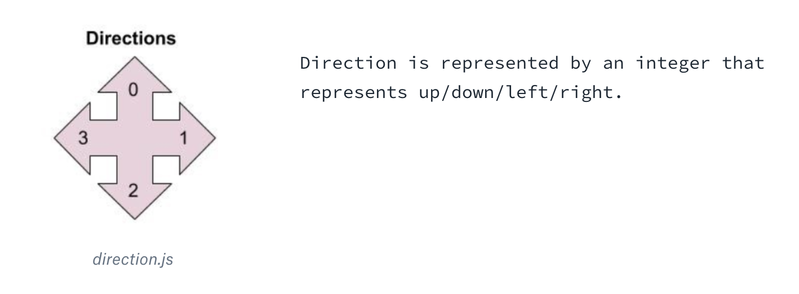
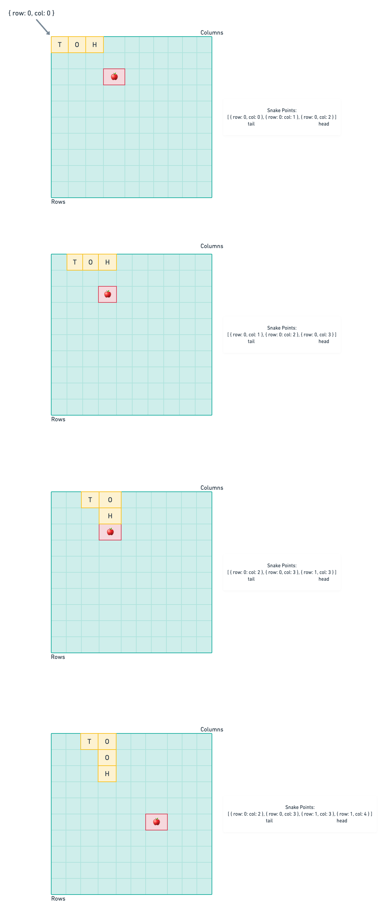

# Setting Up

Using yarn:
1. `yarn`
2. `yarn start`

Using npm:
1. `npm install`
2. `npm run-script start`

# Game Walk Through
[Example Game](https://www.google.com/fbx?fbx=snake_arcade)

### Game Logistics:
-  There is always a snake on the board
-  There is always a single apple on the board (we have to generate it)
-  At every tick, the snake moves in the direction it's facing
-  The goal of the game is for the snake to eat/collect apples

** _There's a Direction object with enums (UP, DOWN, LEFT, RIGHT) included at the top of the file (`snake-game-logic.js`). Feel free to use `Direction.UP` or `0`, depending on your liking_

